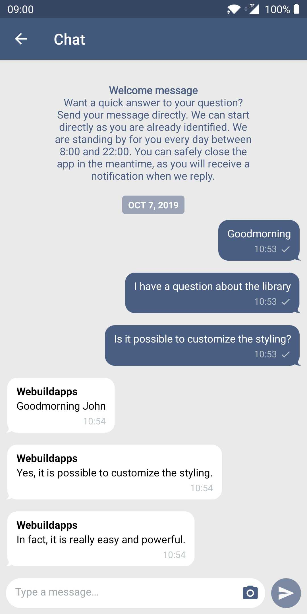

# Parley Messaging Android library

[](https://jitpack.io/#parley-messaging/android-library)

Easily setup a secure chat with the Parley Messaging Android library. The Parley SDK allows you to fully customize the chat style and integrate it seamlessly in your own app for a great user experience.

*Pay attention: You need an `appSecret` to use this library. The `appSecret` can be obtained by contacting [Parley](https://www.parley.nu/).*

## Screenshots

Empty | Conversation
-- | --
 | 

## Features

- Chat: Send and receive text messages by using Parley.
- Images and gifs: Send and receive images, including gifs, within the chat.
- Messages with actions: Provide custom action buttons, allowing the user to choose from a set of actions.
- Carousel messages: Sending carousel messages as an agent when using rich messaging.
- Nested messages: Carousel messages support the same features as other messages inside the chat.
- Answer Suggestions: Agents can provide reply suggestions for users when using rich messaging.
- Custom styling: Fully change the styling of the chat to match your brand. All elements can be styled based on your preference.
- Accessibility: Full support for TalkBack, font scaling, and display Scaling for a more accessible experience.

## Requirements

- Java 17
- Kotlin 1.9.24
- Android 5+ (API 21+)
- Android target API 34 (Android 14)
- Using AndroidX artifacts
- Permissions (automatically added by the library)
  - android.permission.INTERNET - Required for chatting
  - android.permission.ACCESS_NETWORK_STATE - Required for detecting network changes
  - android.permission.POST_NOTIFICATIONS - Required for showing notifications on API >= 33

**Firebase**

For remote notifications Parley relies on Google Firebase. Configure Firebase (using the [installation guide](https://firebase.google.com/docs/android/setup)) if you haven't configured Firebase yet.

## Installation

[JitPack](https://jitpack.io/) is a public maven repository and serves maven artifacts. For usage and installation instructions, visit their website.

To use JitPack, specify the following in your root `build.gradle` file:

```groovy
allprojects {
    repositories {
        // ...
        maven { url 'https://jitpack.io' }
    }
}
``` 

To integrate Parley, specify the following in your `app/build.gradle` file:

```groovy
implementation 'com.github.parley-messaging:android-library:3.12.0'
```

### Upgrading

Checkout [CHANGELOG.md](CHANGELOG.md) for the latest changes and upgrade notes.

## Getting started

Follow the next steps to get a minimal setup of the library.

### Step 1: Add the `ParleyView`

The `ParleyView` can be added to any view that exists in a *Fragment* or an *Activity*.

Add the `ParleyView` to the layout resource file.

```xml
<nu.parley.android.view.ParleyView
    android:id="@+id/parley_view"
    android:layout_width="match_parent"
    android:layout_height="match_parent" />
```


### Step 2: Configure Parley

Configure Parley with your `appSecret` with `Parley.configure(context, secret)` (for example in your *Activity* from step 1).

```java
Parley.configure(this, "appSecret");
```

*Replace `appSecret` by your Parley `appSecret`. The `appSecret` can be obtained by contacting [Parley](https://www.parley.nu/).*

*Note: calling `Parley.configure()` twice is unsupported, make sure to call `Parley.configure()` only once for the lifecycle of Parley.*

### Step 3: Configure Firebase

Parley needs a push token to successfully handle remote notifications.

**Push Token**

After receiving a push token via your Firebase instance, pass it to the Parley instance in order to support remote notifications. This is can be done by using `Parley.setPushToken(pushToken);`.

```kotlin
Parley.setPushToken(token)
// Parley.setPushToken(token, PushType.FCM) // Default
// Parley.setPushToken(token, PushType.CUSTOM_WEBHOOK)
// Parley.setPushToken(token, PushType.CUSTOM_WEBHOOK_BEHIND_OAUTH)
```

**Handle remote notifications**

Open your `FirebaseMessagingService` and:

- Add `Parley.setPushToken(token)` to the `onNewToken` method to update the push token when this happens.
- Add `Parley.handle(context, remoteMessage, intent)` to the `onMessageReceived` method to handle remote notifications.

```kotlin
class FirebaseMessagingService : FirebaseMessagingService() {
  override fun onNewToken(token: String) {
    super.onNewToken(token)

    Parley.setPushToken(token)
  }

  override fun onMessageReceived(remoteMessage: RemoteMessage) {
    super.onMessageReceived(remoteMessage)

    val intent = Intent(this, ChatActivity::class.java)
    intent.setFlags(Intent.FLAG_ACTIVITY_NEW_TASK or Intent.FLAG_ACTIVITY_CLEAR_TASK)

    @Suppress("UNUSED_VARIABLE")
    val handledByParley = Parley.handle(this, remoteMessage.data, intent)
  }
}
```

### Step 4: Forward *Activity* results

Open the *Activity* in which the `ParleyView` is visible and add `Parley.onActivityResult(requestCode, resultCode, data)` to the `onActivityResult` method of the *Activity*.

```kotlin
@Deprecated("Deprecated in Java")
override fun onActivityResult(requestCode: Int, resultCode: Int, data: Intent?) {
  super.onActivityResult(requestCode, resultCode, data)

  @Suppress("UNUSED_VARIABLE")
  val handledByParley = MethodsBase.onActivityResult(requestCode, resultCode, data)
}
```

Also add `Parley.onRequestPermissionsResult(requestCode, permissions, grantResults)` to the `onRequestPermissionsResult` method of the *Activity*.

```kotlin
override fun onRequestPermissionsResult(
  requestCode: Int,
  permissions: Array<String>,
  grantResults: IntArray
) {
  super.onRequestPermissionsResult(requestCode, permissions, grantResults)

  @Suppress("UNUSED_VARIABLE")
  val handledByParley = MethodsBase.onRequestPermissionsResult(requestCode, permissions, grantResults)
}
```

### Step 5: Network Security Configuration

By default Parley enforces the use of SSL pinning. Open the `AndroidManifest.xml` and add the Network Security Configuration of Parley to the `Application` tag.

```xml
<application
    android:networkSecurityConfig="@xml/parley_network_security_config">
```

*More information about the Network Security Configuration can be found on [Android Developers](https://developer.android.com/training/articles/security-config).*

## Advanced

Parley allows the usage of advanced configurations, such as specifying the network, specifying the user information or enabling offline messaging. In all use cases it is recommended to apply the advanced configurations before configuring the chat with `Parley.configure(secret)`.

### Network

The network configuration can be set by setting a `ParleyNetwork` with the `Parley.setNetwork(_ network: ParleyNetwork)` method.

```kotlin
val headers = mutableMapOf<String, String>()
headers["X-Custom-Header"] = "Custom header value"

val network = ParleyNetwork(
  "https://api.parley.nu/", // Default
  "clientApi/v1.9/", // Default
  ApiVersion.V1_9, // Must correspond to the same version in the path
  nu.parley.android.R.xml.parley_network_security_config, // Must be the same resource as defined in `AndroidManifest.xml`
  headers, // Optional, default empty map 
)

Parley.setNetwork(network) // Optional, defaults to Parley configuration
```

*Note that when using a custom Network Security Configuration, it is also required to use the same reference in inside the `AndroidManifest.xml`.*

**Custom interceptor**

If the only need is to apply a custom interceptor to the default network session of Parley, for example when using dynamic headers. It's possible to create an `okhttp3.Interceptor`, create the default `RetrofitNetworkSession` with the interceptor and provide that to the `ParleyNetwork` configuration.

```kotlin
val networkSession = RetrofitNetworkSession(interceptor);

val network = ParleyNetwork(
    "https://api.parley.nu/",
    "clientApi/v1.9/",
    ApiVersion.V1_9,
    nu.parley.android.R.xml.parley_network_security_config,
    headers,
    networkSession,
)

Parley.setNetwork(network)
```

**Custom network config**

If using a custom interceptor is not enough, it's also possible to fully create you own `ParleyNetworkSession` implementation. You'll need to implement the `ParleyNetworkSession` interface. Then provide the custom `ParleyNetworkSession` to the `ParleyNetwork` configuration:

```java
ParleyNetworkSession networkSession = new CustomNetworkSession();
ParleyNetwork network = new ParleyNetwork(
        "https://api.parley.nu/",
        "clientApi/v1.7/",
        ApiVersion.V1_7,
        R.xml.parley_network_security_config,
        networkSession
);

Parley.setNetwork(network);
```

**Custom SSL pinning**

With the default configuration Parley enforces SSL pinning. Customizing this can be done by creating a new `network_security_config.xml` file.

In the `AndroidManifest.xml` set the `networkSecurityConfig` property to the created `network_security_config.xml`.

Next, pass the new `network_security_config` to the ParleyNetwork object when calling `Parley.setNetwork(network)`.

**Enforcing SSL pinning**

Parley uses TrustKit to support SSL pinning on lower API levels. To enforce SSL pinning, make sure that the `network_security_config.xml` has the following in the `<domain-config>` block as well:

```xml
<trustkit-config enforcePinning="true"/>
```

*Note that setting this `true` will enforce SSL pinning and causes all requests to fail if SSL pinning fails. Whereas setting this `false` will still execute SSL pinning, but requests will proceed if SSL pinning fails.*

When a certificate is going to expire you can safely transition by adding the new pin to the `network_security_config.xml`. It is important to leave the old pin in the app until after the new one is valid. In the next release the old pin can be removed. However, Android requires at least 2 pins inside the `network_security_config.xml`, so the old one can remain until the next one is needed.

### User information

The chat can be identified and encrypted by applying an authorization token to the `Parley.setUserInformation(authorization)` method. The token can easily be generated on a secure location by following the _[Authorization header](https://developers.parley.nu/docs/authorization-header)_ documentation.

```kotlin
val authorization = "ZGFhbnw5ZTA5ZjQ2NWMyMGNjYThiYjMxNzZiYjBhOTZmZDNhNWY0YzVlZjYzMGVhNGZmMWUwMjFjZmE0NTEyYjlmMDQwYTJkMTJmNTQwYTE1YmUwYWU2YTZjNTc4NjNjN2IxMmRjODNhNmU1ODNhODhkMmQwNzY2MGYxZTEzZDVhNDk1Mnw1ZDcwZjM5ZTFlZWE5MTM2YmM3MmIwMzk4ZDcyZjEwNDJkNzUwOTBmZmJjNDM3OTg5ZWU1MzE5MzdlZDlkYmFmNTU1YTcyNTUyZWEyNjllYmI5Yzg5ZDgyZGQ3MDYwYTRjZGYxMzE3NWJkNTUwOGRhZDRmMDA1MTEzNjlkYjkxNQ";
Parley.setUserInformation(authorization);
```

**Additional information**

Additionally, you can set additional information of the user by using the `additionalInformation` parameter in `Parley.setUserInformation()` method. The parameter accepts a `Map<String, String>`.

```kotlin
val additionalInformation = mutableMapOf<String, String>()
additionalInformation[Parley.ADDITIONAL_VALUE_NAME] = "John Doe"
additionalInformation[Parley.ADDITIONAL_VALUE_EMAIL] = "j.doe@parley.nu"
additionalInformation[Parley.ADDITIONAL_VALUE_ADDRESS] = "Randstad 21 30, 1314, Nederland"

val authorization = ParleyCustomerAuthorization.example()
Parley.setUserInformation(authorization, additionalInformation)
```

**Clear user information**

```kotlin
Parley.clearUserInformation() // Clear user information if needed (for example when the user logs out).
```

### Offline messaging

Offline messaging can be enabled with the `Parley.enableOfflineMessaging(dataSource)` method. `ParleyDataSource` is an interface that can be used to create your own (secure) data source. In addition to this, Parley provides an encrypted data source called `ParleyEncryptedDataSource` which uses AES encryption.

```kotlin
val dataSource = ParleyEncryptedDataSource(context, "1234567890123456")
Parley.enableOfflineMessaging(dataSource) // Optional, default off
```

**Disable offline messaging**

```kotlin
Parley.disableOfflineMessaging() // Disable offline messaging if it was enabled earlier
```

### Send a (silent) message

In some cases it may be handy to send a message for the user. You can easily do this by calling;

```kotlin
Parley.send("Lorem ipsum dolar sit amet")
```

**Silent**

It is also possible to send silent messages. Those messages are not visible in the chat.

```kotlin
Parley.send("User opened chat", true)
```

### Referrer

```kotlin
Parley.setReferrer("https://parley.nu/")
```

### Custom Unique Device Identifier

By default Parley uses a random UUID as device identifier which will be stored in the shared preferences. This can be overridden by passing a custom `uniqueDeviceIdentifier` to the configure method:

```kotlin
Parley.configure(this, "appSecret", "uniqueDeviceIdentifier")
```

_When passing the `uniqueDeviceIdentifier` to the configure method, Parley will not store it. Client applications are responsible for storing it and providing Parley with the same ID in this case._

### Reset (logout)

Parley doesn't need to be reset usually, but in some cases this might be wanted. For example when a user logs out and then logs in with a different account. 

Resetting Parley will clear the current user information and chat data that is in memory as well as deregister the device's push token to Parley. This ensures that registered users will not receive push notifications anymore that are not intended for them. Requires calling the `configure()` method again to use Parley.

```kotlin
Parley.reset()
```

### Purge memory

There is also the possibility to only remove the data that is in memory of Parley. The difference with the `reset()` method is that this one does not update the backend. In fact, this can be seen as the app going 'inactive' and clearing its memory, while the user keeps being logged in. However, Parley will not be able to recover from this automatically and therefore it is required to call the `configure()` method again to use Parley.

```kotlin
Parley.purgeLocalMemory()
```

### Handling Activity results inside Fragment

By default Parley uses the activity when it calls `startActivityForResult()` or `requestPermissions()`, resulting in the `onActivityResult` and `onRequestPermissionsResult` being called on the activity in return. However, when the `ParleyView` is used inside a fragment, it is more neat to handle these results inside the fragment as well. This can be done by setting the launch callback on the `ParleyView`:

```java
parleyView.setLaunchCallback(new ParleyLaunchCallback() {
    @Override
    public void launchParleyActivity(Intent intent) {
        startActivity(intent);
    }

    @Override
    public void launchParleyActivityForResult(Intent intent, int requestCode) {
        startActivityForResult(intent, requestCode);
    }

    @Override
    public void launchParleyPermissionRequest(String[] permissions, int requestCode) {
        requestPermissions(permissions, requestCode);
    }
});
```

Next, make sure to forward the *Fragment* results:

```java
@Override
public void onActivityResult(int requestCode, int resultCode, @Nullable Intent data) {
    super.onActivityResult(requestCode, resultCode, data);

    boolean handledByParley = Parley.onActivityResult(requestCode, resultCode, data);
}

@Override
public void `onRequestPermissionsResult`(int requestCode, @NonNull String[] permissions, @NonNull int[] grantResults) {
    super.onRequestPermissionsResult(requestCode, permissions, grantResults);

    boolean handledByParley = Parley.onRequestPermissionsResult(requestCode, permissions, grantResults);
}
```

> Note: Now that since the Fragment is handling these results now, the Activity no longer needs to forward the `onActivityResult` and `onRequestPermissionsResult` methods to Parley. So these can be removed from the Activity.

### Handling Downloads

By default Parley uses the `DefaultParleyDownloadCallback` which downloads files by using the native `DownloadManager` and stores them in the internal storage of the app. After downloading, it will offer the user to open the downloaded file by using the `ParleyLaunchCallback`.

To change this default behavior, the download callback can be overridden by a custom implementation:

```java
parleyView.setDownloadCallback(new ParleyDownloadCallback() {
  @Override
  public void launchParleyDownload(String url, Map<String, String> headers) {
    // ...
  }
});
```

> Note: Make sure to apply the headers when downloading the file from the given url. Otherwise the file download will not succeed.

## Customize

### Callbacks

Parley provides a `ParleyView.Listener` that can be set on the `ParleyView` for receiving callbacks.

```java
parleyView.setListener(new ParleyView.Listener() {
    @Override
    public void onMessageSent() {
        Log.d("Parley", "The user did sent a message");
    }
});
```

### Styling

**Images**

Image upload is enabled by default. The `ParleyView.setImagesEnabled(enabled)` method can be used to disable this.

```kotlin
parleyView.setImagesEnabled(false)
```

**Notifications position**

The sticky and internet connection notifications are placed on the top by default. The `ParleyView.setNotificationsPosition(position)` can be used to bring them to the bottom.

```kotlin
parleyView.setNotificationsPosition(ParleyPosition.Vertical.BOTTOM)
```

**Styling**

Parley comes with a default style by using the Android resource files. Customizing the style can be done by overriding the values of Parley. Check out [parley_configuration.xml](parley/src/main/res/values/parley_configuration.xml) for the available options.

## License

Parley is available under the MIT license. See the [LICENSE](LICENSE) file for more info.
